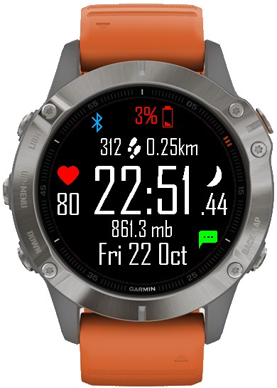

[](https://github.com/claudiocandio/Garmin-WatchCLC/blob/master/LICENSE)
[](https://developer.garmin.com/connect-iq/monkey-c/)
[](https://www.paypal.com/donate?hosted_button_id=VLWUKUV3KRZA2)

# Garmin Fenix 6 Watch Face

This is the Watch Face I'm using for my Garmin Fenix 6 Sapphire and Forerunner 735xt.

I also added more compatible watches but just tested them using the simulator, I'm not sure they are all ok.  

**Garmin IQ Store:** <https://apps.garmin.com/en-US/apps/8a17a33d-da70-4c6b-a53e-de51537c9c24>



### Watch Face Settings

&emsp;- Background Color  
&emsp;- Foreground Color  
&emsp;- Low Battery %  
&emsp;- Enable/Disable: Military Format Time  
&emsp;- Enable/Disable: Notification Icon  
&emsp;- Enable/Disable: Seconds Always On  
&emsp;- Data Field 1 & 2  
&emsp;&emsp;Calories  
&emsp;&emsp;Date  
&emsp;&emsp;Pressure  
&emsp;&emsp;Altitude  
&emsp;&emsp;Floors Climbed  
&emsp;&emsp;Floors Descended  
&emsp;&emsp;Active Minutes Day  
&emsp;&emsp;Active Minutes Week  
&emsp;&emsp;Active Minutes Week Goal  
&emsp;&emsp;Empty  

### Import this project with Eclipse IDE for Java

```bash
git clone https://github.com/claudiocandio/Garmin-WatchCLC
mv Garmin-WatchCLC WatchCLC
```

Open Eclipse and import the project.

## Disclaimer

THE SOFTWARE IS PROVIDED "AS IS", WITHOUT WARRANTY OF ANY KIND.
